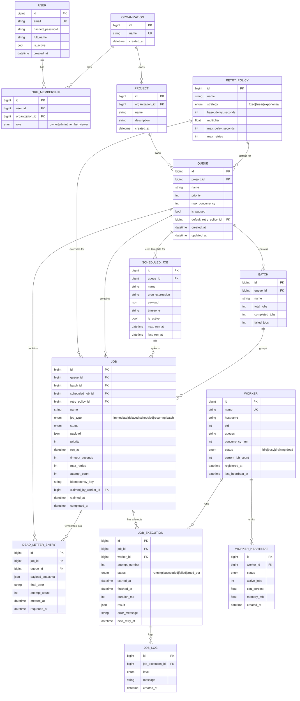

# Entity-Relationship Diagram & Schema Design

Full source of truth: `backend/app/models.py` (SQLAlchemy 2.0 declarative
models). This document is the narrative companion to that file.

## Diagram

## Design rationale

### Primary keys
Every table uses a surrogate `BIGINT` identity primary key rather than a
natural key. Business-meaningful uniqueness (`users.email`,
`organizations.name`, `(project_id, name)` on queues,
`(queue_id, idempotency_key)` on jobs) is enforced with separate `UNIQUE`
constraints. This keeps every foreign key a fixed-width integer — cheap to
index and join — and means a business key can change (e.g. renaming a
queue) without touching any child row's foreign key.

### Foreign keys and cascade behavior
The schema has one clear ownership spine:
`Organization → Project → Queue → Job → JobExecution → JobLog`, and a
second one for workers: `Worker → WorkerHeartbeat`. Every FK along an
ownership spine is `ON DELETE CASCADE`, because a child row has no
independent meaning once its parent is gone — an execution log for a job
that no longer exists is noise, not an audit trail.

`DeadLetterEntry.job_id` is the deliberate exception: `ON DELETE RESTRICT`.
A dead-letter entry is written once, at the moment a job is permanently
failed, and is meant to be an audit record that outlives the normal
job-retention window. It also stores a `payload_snapshot` (denormalized
copy of the job's payload) precisely so it stays inspectable and
replayable even if `Job` rows are later purged by a retention job —
deliberately breaking strict normalization here in exchange for DLQ
entries never going stale or dangling.

`Queue.default_retry_policy_id` and `Job.retry_policy_id` are
`ON DELETE SET NULL`: deleting a shared retry policy shouldn't cascade
into deleting every queue/job that referenced it, it should just fall back
to the hardcoded defaults in `record_result()`.

### Indexes
- **`ix_jobs_claim (queue_id, status, priority, run_at)`** is the most
  important index in the schema. It's the exact predicate + sort order
  the worker claim query uses:
  `WHERE queue_id = ? AND status = 'queued' AND run_at <= now()
  ORDER BY priority DESC, run_at ASC`. Without this composite index the
  claim query — which runs on every worker's poll cycle, i.e. constantly —
  would force either a full table scan or a much less selective single
  column index.
- **`ix_execution_job` / `ix_joblog_execution_time`** support the two most
  common dashboard reads: "show me every attempt for this job" and "show
  me this attempt's logs in order."
- **`ix_heartbeat_worker_time (worker_id, created_at)`** supports charting
  a single worker's health over time without scanning every worker's
  heartbeats.
- **`ix_scheduled_jobs_next_run (is_active, next_run_at)`** supports the
  scheduler's cron-tick query, which is `WHERE is_active AND next_run_at
  <= now()` on every tick.
- Unique constraints double as indexes where they matter for lookups:
  `(queue_id, idempotency_key)` for the idempotent-submission check,
  `(job_id, attempt_number)` for locating "the execution row for this
  attempt" in `record_result()`.

### Normalization
The schema is in 3NF except for the one documented denormalization
(`DeadLetterEntry.payload_snapshot`, justified above). `RetryPolicy` is
factored into its own table — rather than inlined as columns on `Queue`
and `Job` — specifically so the same policy can be shared across queues
and audited/edited independently of anything referencing it.
`WorkerHeartbeat` is append-only and separate from `Worker` (which holds
only the latest snapshot) so heartbeat history doesn't bloat or contend
with the row every claim/heartbeat call touches.

### Performance considerations at scale
- The claim query's `FOR UPDATE SKIP LOCKED` transaction is intentionally
  tiny (lock → update → commit), never wrapping job execution itself, so
  lock hold time stays in the low milliseconds regardless of how long a
  job takes to run.
- `WorkerHeartbeat` and `JobLog` are the two tables that grow unbounded in
  a live system; both are append-only with a `created_at`-anchored index,
  which is exactly the shape that benefits from time-based partitioning
  or a retention job once volume justifies it (see
  `docs/DESIGN_DECISIONS.md`).
- `Job.payload` and `JobExecution.result` are `JSON` columns rather than a
  fully normalized key/value schema — job payloads are inherently
  variable-shape per job type, and forcing them into relational columns
  would mean either a sparse mega-table or an EAV anti-pattern for no
  querying benefit this system actually needs.
